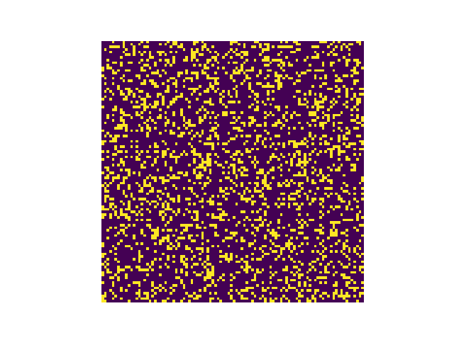

# RMS — Lattice Dynamics & Regime Mapping

## Overview

RMS is an experimental lattice-based system exploring how simple local coupling rules produce distinct global behaviours.

The system operates on a 2D toroidal grid where each cell updates based on:

* self influence
* neighbour influence
* stochastic noise
* thresholding

This produces a set of emergent regimes.

## Update Rule

Each cell holds a binary state:

state ∈ {0, 1}

At each step, the system calculates the mean activity of the eight neighbouring cells using a Moore neighbourhood on a toroidal grid.

neighbour_mean = sum(active neighbours) / 8

The cell then calculates a local pressure value:

pressure = (self_weight × current_state) + (nbr_weight × neighbour_mean)

The next state is determined by thresholding:

next_state = 1 if pressure >= threshold  
next_state = 0 otherwise

After this deterministic update, stochastic noise is applied:

with probability noise:  
    next_state = 1 - next_state

This creates a simple local Markov-style lattice system where global behaviour emerges from repeated local updates.

Reference Parameter Sets

The following parameter sets are used as reference points for the regimes described in this project.

## Reference Parameter Sets

| Regime                         | seed_density | self_weight | nbr_weight | threshold | noise  | seed |
|--------------------------------|--------------|-------------|------------|-----------|--------|------|
| V5 — Dominant Coalescence      | 0.26         | 0.35        | 0.65       | 0.42      | 0.0010 | 42   |
| V6 — Dynamic Cluster Field     | 0.24         | 0.28        | 0.72       | 0.46      | 0.0012 | 42   |
| V9 — Sparse Metastability      | 0.24         | 0.28        | 0.72       | 0.505     | 0.0010 | 42   |

N = 100
steps = 1000
boundary = toroidal
neighbourhood = Moore, 8 neighbours

---

## Key Finding

Across parameter space, three primary behavioural regimes appear:

### V5 — Dominant Coalescence

* Single large cluster forms
* System converges toward uniformity

### V6 — Dynamic Cluster Field

* Many clusters persist simultaneously
* Clusters interact, merge, fragment
* System remains active without collapsing

### V9 — Sparse Metastability

* Small isolated clusters
* Minimal interaction
* Low global activity

The V6 regime is of particular interest:

It represents a stable region where structure persists without dominance or collapse.

---

## Project Structure

src/       → core engine + runners
configs/   → parameter definitions
runs/      → example outputs
docs/      → notes / future work

---

## Running the System

From the project root:

### Batch presets

python src/rms_binary_cluster_batch_v15.py

### Micro sweep

python src/rms_binary_cluster_micro_sweep_v16.py

Outputs are written to:

runs/

---

## Example Output

A curated run demonstrating dynamic cluster behaviour is included in:

runs/

Specifically:

v16_run_0310_thr_0p47_self_0p3_noise_0p0012_dens_0p24_seed_42_...

This run sits within the V6 basin and shows sustained dynamic cluster organisation.

The included GIF illustrates cluster interaction, persistence, and reconfiguration over time.

---

## Current Focus

* mapping parameter regimes
* identifying stable behavioural regions
* exploring transition boundaries between regimes

---

## Future Work

* phase-coupled extension of the system
* binary projection of phase dynamics
* investigation of hidden coupling behaviour
* signal transport experiments within constrained geometries

---

## Notes

This is an exploratory system focused on behaviour and structure, not a finished model.

Interpretations are grounded in observed telemetry and reproducible runs.
